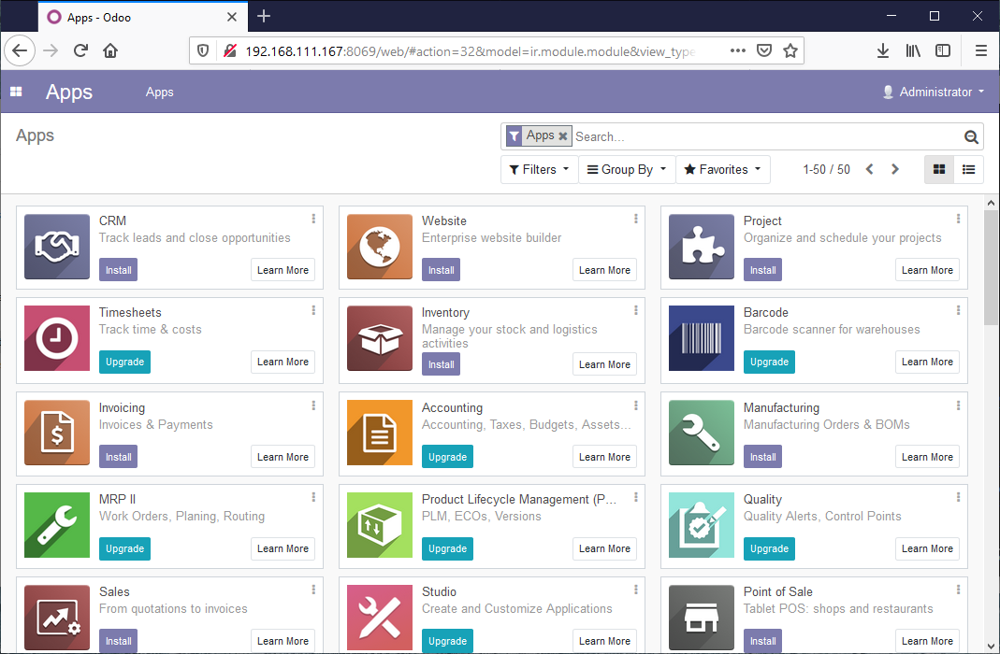
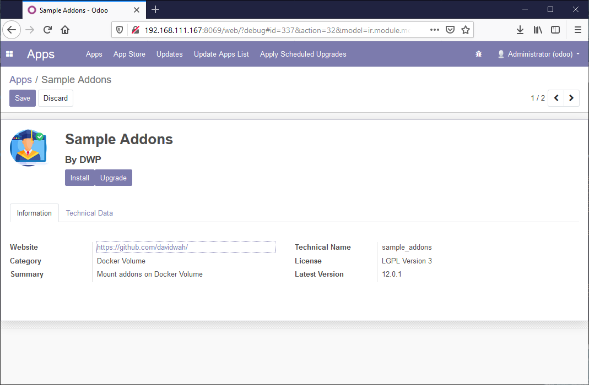
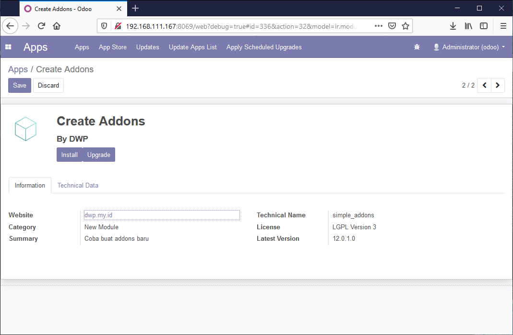

# Odoo12 running on docker - test  

## How to run
Change directory permission 
```
chmod -R 775 my-adons
chmod -R 775 config
```
Running container in background
```
docker-compose up -d
```
Access on your browser
```
http://localhost:8012
```
## odoo database manager  
  

## odoo apps dashboard  
  

## odoo apps addons  
  

## odoo sample addons  
  

## odoo simple addons  
  
